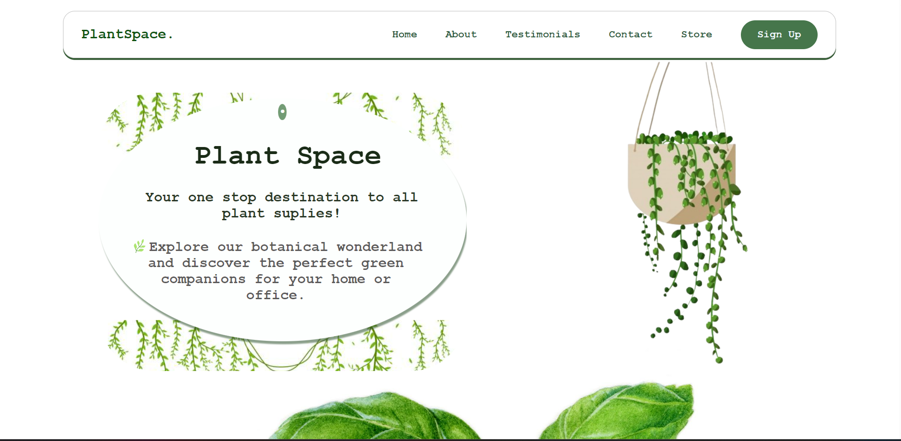

# PlantSpace
<h2>Description:</h2>

<p>Welcome to PlantSpace, a delightful web application that seamlessly combines greenery with technology. PlantSpace offers a harmonious space for plant enthusiasts and nature lovers to explore, learn, and connect with the beauty of nature. Our mission is to inspire a deeper connection with plants, making nature more accessible and enjoyable for everyone.</p>

<h2>Key Features:</h2>
<ul>
<li>Explore a curated collection of plants.</li>
<li>Learn about the benefits of incorporating plants into daily life.</li>
<li>Create a serene and green environment in your home and workspace.</li>
</ul>
<h2>Technologies Used:</h2>
<ul>
  <li>React.js for the front-end development.</li>
<li>Responsive design for a seamless user experience across devices.</li>

</ul>

<h2>Get Started:</h2>
<ul>
  <li>Clone the repository.</li>
<li>Install dependencies using npm install.</li>
  ```sh
  
  ```
<li>Run the application with npm start.</li>
</ul>

